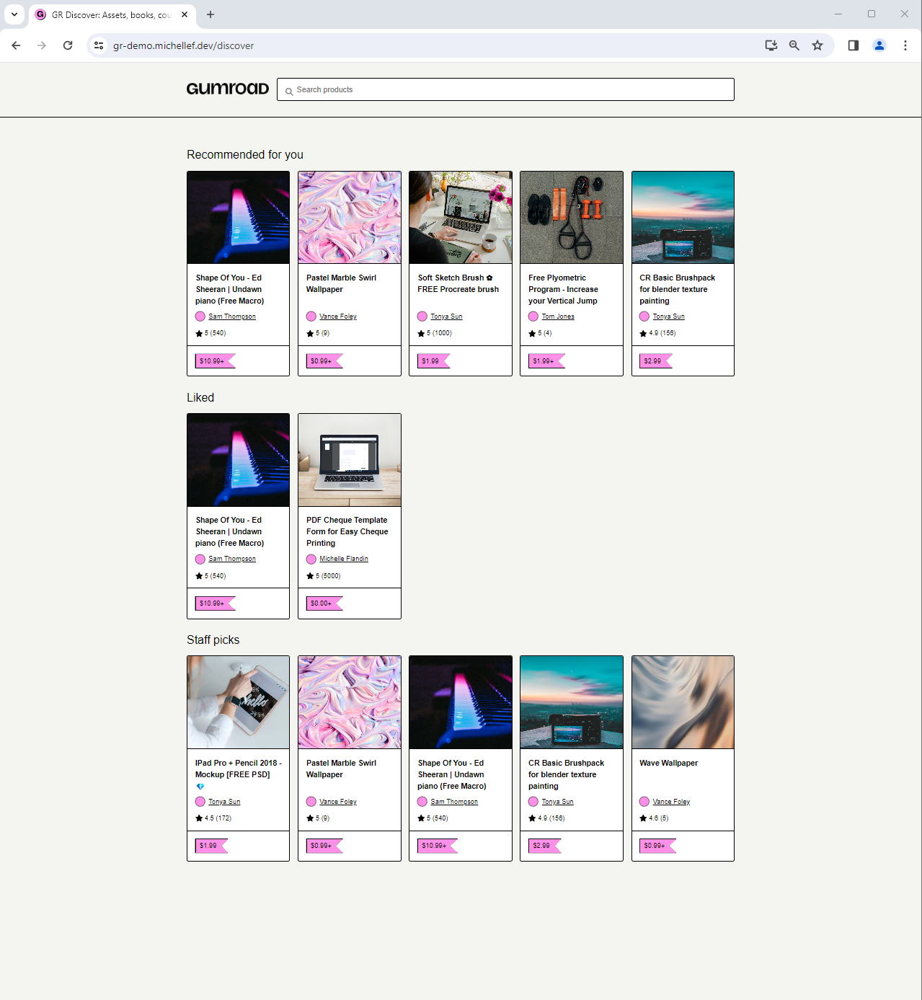
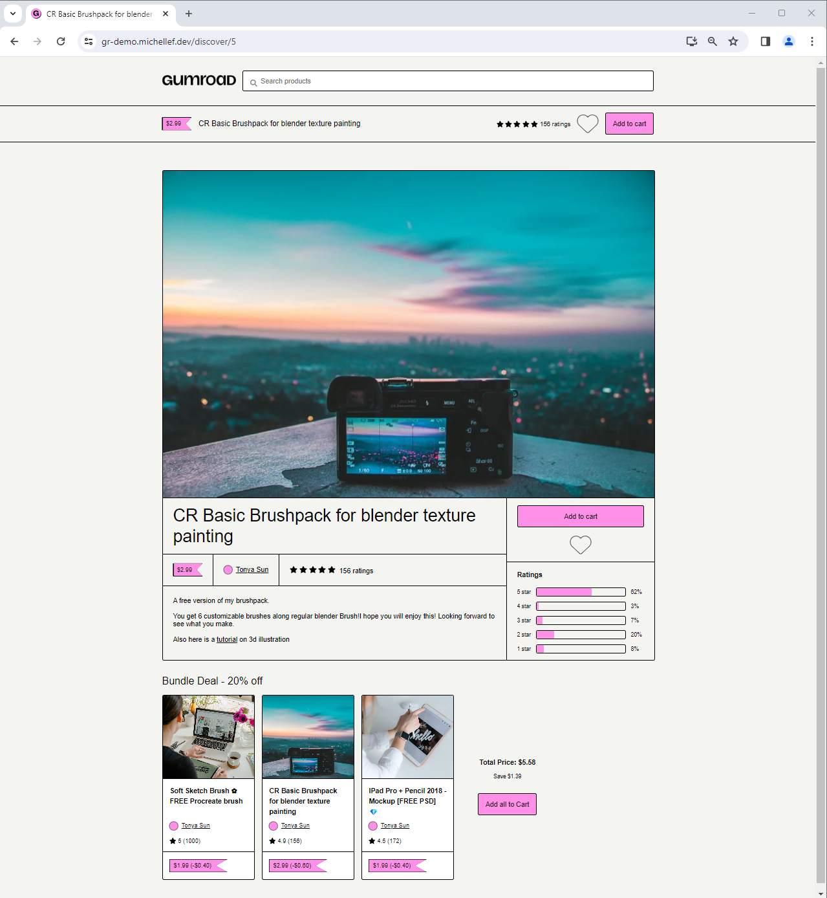

# GR Product Engineering Challenge 

This project is a simplified replication of the GR Discover and Product Page user experience, developed using Rails and React. It incorporates core features of the original interface with several enhancements to improve user interaction and engagement. 

## Table of Contents
- [Technologies Used](#technologies-used)
- [Feature Overview](#feature-overview)
- [Architectural Decisions](#architectural-decisions)
- [What I Learned](#what-i-learned)
- [Basic Usage](#basic-usage)
  - [How to Interact with the Database in Development](#interact-db)
  - [How to Modify Database Schema](#modify-db)
  - [How to Seed the Database](#seed-db)
  - [How To Reset the Database](#reset-db)
  - [How To Update the App](#update-app)
  - [Heroku Troubleshooting](#heroku-troubleshooting)
- [Features To Add](#features-to-add)
- [Credits](#credits)

## Technologies Used
  - Ruby
  - Rails
  - React
  - Typescript
  - Heroku
  

## Feature Overview
- **Discover Page 'Liked' Section:** A new section on the 'Discover' page to display products that the user has liked.
- **Product Page 'Like' Button:** An interactive heart icon allowing users to 'like' or 'unlike' products.
- **Product Page 'Bundle' Section:** A section that appears at the bottom of the product page if the product is part of a 'bundle'.

  
  

## Architectural Decisions
- **Relational Database Design:** To handle dynamic relationships like product likes and bundles, I implemented a relational schema with join tables (e.g., bundle_products), enhancing data integrity and relationship management.
- **Route Configuration in Rails:** Strategically ordered routes in routes.rb to prioritize functionality (e.g., search routes) and correctly handle SPA routing with a catchall route.
- **Build Process Automation:** Chose batch files over npm scripts for build and deployment tasks to minimize dependencies and ensure compatibility with Heroku's buildpacks, avoiding potential deployment issues.

## What I Learned
 - **Relational Database Design:** Initially, liked_products were stored as arrays within the User table, a simple but flawed approach due to issues with stale references upon product deletions. Transitioning to a relational design, I used bundles and a join table bundle_products to establish many-to-many relationships, significantly enhancing data integrity and fetch efficiency. This shift highlighted the value of adaptable database schemas for dynamic application needs.
- **Routing Order Significance:** Implementing the search functionality brought to light the importance of the order of routes in the config/routes.rb file. Placing the search route before the resources block ensured it was matched first, while the catchall route for the single-page application had to be placed at the very end. This lesson in routing order was instrumental in achieving both functional search features and seamless SPA (Single Page Application) navigation.
- **Controller Callbacks:** I learned the importance of selectively applying before_action callbacks in controllers after encountering a limitation while handling the bundles method in my products controller. This method required fetching not only the product but also its associated bundles and related users, rendering it unsuitable for conventional before_action usage.

## Basic Usage

### How to Interact with the Database in Development
- *The rails console allows you to interact directly with your application's database*
- In the terminal, navigate to the project's root directory
  - **Enter Rails Console:** `rails console`
  - **View All Records:** `Product.all`
  - **View First Record:** `Product.first`
  - **Create New Record:** `Product.create(product_name: "New Product", price: 100)`
  - **Delete All Record:** `Product.delete_all`

### How To Modify Database Schema
- In the terminal, navigate to the project's root directory
  - Generate a migration
    - e.g. `rails generate migration ChangeFieldTypeInProducts`
  - Open the newly created migration file in db/migrate
  - Inside the migration file's 'def change' section, add the command needed to make the change
    - e.g. `rename_column :products, :creator_name, :user`
  - Run the migration
    - Development: `rails db:migrate`
    - Production: `heroku run rake db:migrate -a gr-demo`

### How to Seed the Database
- *This command will seed the database with mock data from the JSON files in lib/seeds*
- In the terminal, navigate to the project's root directory
  - Run the seed command
    - Development: `rail db:seed`
    - Production: `heroku run rake db:seed --app gr-demo`

### How To Reset the Database
- *This script will clear the entries from all tables (i.e. Product, User, Bundle) then reseed the database with the mock data from the JSON files in lib/seeds*
- In the terminal, navigate to the project's root directory
  - Run: `.\reset-db.bat`

### Updating the Heroku App
- *This script will rebuild the reactapp in the correct folder and push the changes to GitHub, and every push to main will deploy a new version of the app on Heroku*
- In the terminal, navigate to the project's root directory
  - Run: `.\update-app.bat "Your commit message here`

### Heroku Troubleshooting
- Reminders:
  - After updating routes.rb file: 
    - Make sure to restart the Heroku server after modifying the routes.rb file 
  - If the frontend isn't working
    - Check if the public folder has the index.html file (if not the reactapp build has failed due to compile error)
- Error Logging: 
  - To log errors in backend (e.g. controllers) - add this line: 
    - Add this line: `Rails.logger.info "log message here"`
    - Example: `Rails.logger.info "Parameters: #{params.inspect}"`
    - This will be printed in the Heroku logs
- Commands:
  - **Error Logs:** `heroku logs --tail -a gr-demo`
  - **Restart Server:** `heroku ps:restart -a gr-demo`

## Features To Add 
- SingleProduct Page: spacing for 'Add all to Cart' section on smaller screen size / more products
- DB: liked_products -> implement join table instead of stale array
- SingleProduct Page: Rating bar chart + accurate star ratings + if 0 ratings -> 'no ratings'
- SingleProduct Page: image carousel sizing when multiple images + transition
- AllProducts Page: Add profile pics for users
- SingleProduct Page: Add profile pics for users
- DB: Modify existing profile pic for users
- SingleProduct Page: implement user highlight_color + background_color
- DB: Add 'Cart' field for users
- Nav: 'Add to Cart' functionality
- SingleProduct Page: 'Add to Cart' functionality
- CSS: define global variables for colors and other properties
- User authentification (liked_products, recently_viewed)
- AllProducts Page: Tailor liked_products section to logged-in user
- Backend: Add recently_viewed functionality

## Credits 
Michelle Flandin